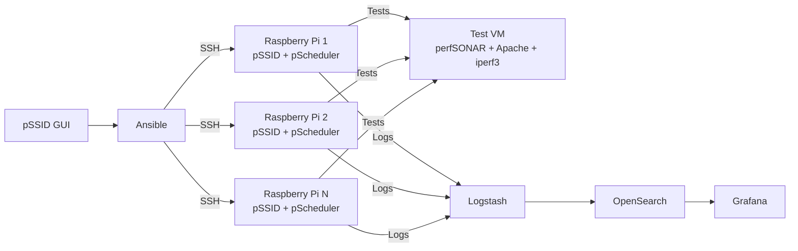
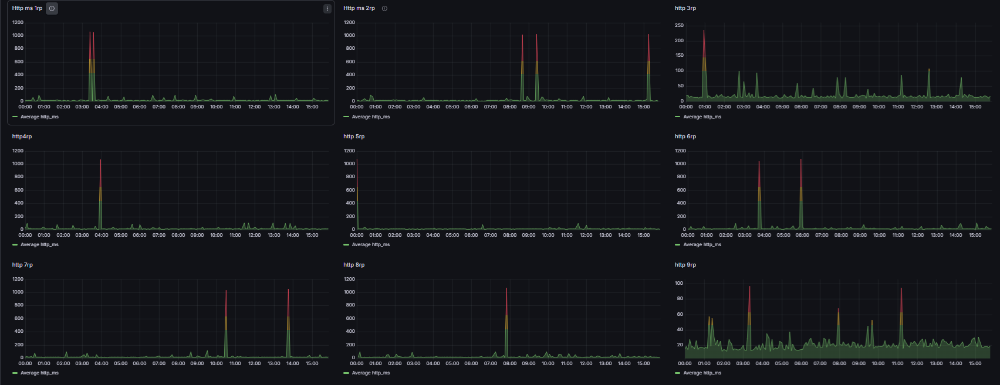
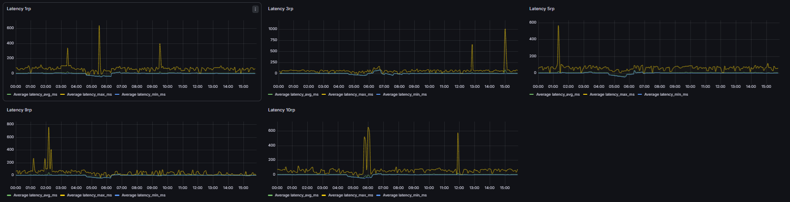
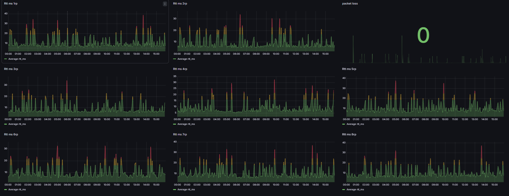
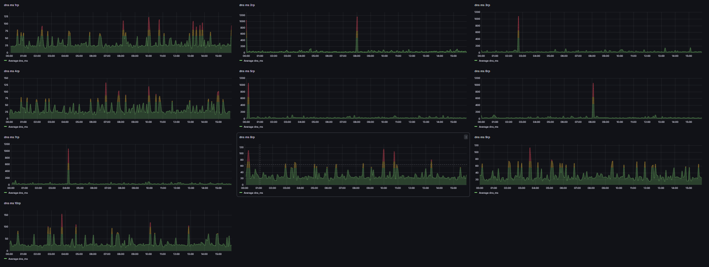
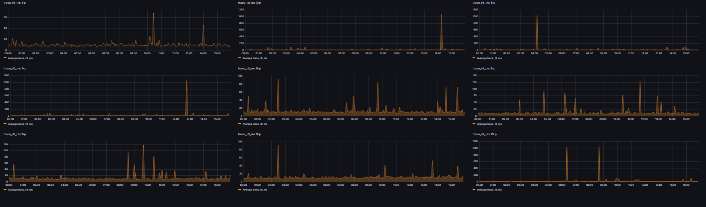
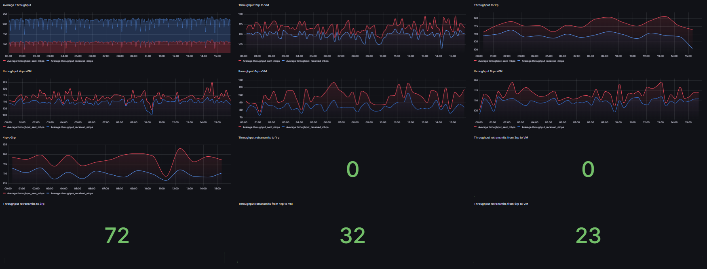

# Technical report on test results and system stability

## Overwiew

The project focused on the development and implementation of an open-source Wi-Fi network monitoring system. The system uses Raspberry Pi 4 devices as distributed measurement nodes, managed and configured through Ansible. The pSSID software is deployed on each node using Ansible and uses perfSONAR 5.x to perform network measurements such as RTT, throughput, DNS, HTTP, and NTP-related tests. A dedicated test VM was configured as a controlled endpoint for network measurements. A separate VM was configured as the controller node, hosting the monitoring stack, Ansible environment, and pSSID GUI. The monitoring stack was implemented using Logstash, OpenSearch, and Grafana, with a monitoring dashboard consisting of seven dedicated views for the different measurements. The project also involved test scheduling and optimization, troubleshooting of networking and measurement components, and validation of the complete data pipeline. Technical documentation was produced covering deployment, configuration, testing, and troubleshooting. In addition, a technical issue was reported to the upstream pSSID project on GitHub and discussed directly with its creator.

## Contents

1. Introduction
2. Tools
3. Results
4. Conclusion

## 1. Introduction

### 1.1 Background

Wi-Fi networks are subject to a number of factor that can affect their performance and reliability, including signal quality, interference, network congestion, hardware characteristics and configuration, walls,etc. Monitoring whether a devcice is connected to Wi-Fi is not enough to fully evaluate the quality of a wireless connection. Measurements such as latency, round-trip time, throughput, DNS response time and HTTP performance can provide more detailed information about the behaviour of the network and help identify performance degradation.

The project was developed in an R&D environment with a focus on DevOps and systems integration. The main objective was to create an automated and reproducible infrastructure capable of continuously collecting network performance measurements from distributed Wi-Fi measurement nodes.

### 1.2 Project Context

The monitoring infrastructure is based on pSSID, an an open-source Wi-Fi monitoring platform developed by the University of Michigan and Virginia Tech. Raspberry Pi 4 devices were used as distributed measurement nodes, allowing network measurements to be performed from different nodes in the infrastructure.

The system integrates several technologies to cover different stages of the monitoring process. Ansible is used to automate the configuration and deployment of the measurement nodes, while perfSONAR 5.x and pScheduler provide the network measurement capabilities. A dedicated virtual machine is used as a controlled endpoint for measurements. A separate controller VM hosts the pSSID GUI, Ansible environment and monitoring stack.

The collected data is processed through Logstash, stored in OpenSearch, and visualized using Grafana. This architecture provides a complete data pipeline from measurement execution on the Raspberry Pi nodes to centralized visualization and analysis.

### 1.3 Objectives

The main objectives of the project were:

- to deploy and configure pSSID on Raspberry Pi 4 measurement nodes;
- to automate node configuration and deployment using Ansible;
- to configure a controlled test environment using a dedicated VM;
- to collect and process measurement results through a centralized data pipeline;
- to store and analyze the collected data using OpenSearch;
- to develop Grafana dashboards for monitoring the different network measurements;
- to design and optimize measurement schedules;
- to troubleshoot and validate the complete monitoring infrastructure;
- to produce technical documentation covering deployment, configuration and troubleshooting;
- to interact with the upstream pSSID open-source project when technical issues were          encountered.

### 1.4 Scope

The work covered the complete infrastructure required to deploy, operate and monitor the measurement system, including hardware configuration, automated deployment, network measurement, data processing, visualization and troubleshooting. Particular attention was given to creating a reproducible environment that could be deployed across multiple Raspberry Pi nodes.

Because throughput measurements can interfere with each other when executed concurrently, throughput testing was performed on a representative subset of nodes rather than simultaneously across the entire infrastructure. Six throughput measurements were used to evaluate the behaviour of the system while avoiding interference between concurrent tests.

This project resulted in a complete monitoring pipeline capable of collecting network performance measurements from distributed Raspberry Pi nodes, processing the resulting data, and presenting it through a centralized Grafana dashboard.

## 2. Tools

### 2.1 Infrastructure

#### 2.1.1 Raspberry Pi devices

Raspberry Pi 4 devices were used as distributed measurement nodes. Each Raspberry Pi runs Ubuntu Server 24.04 and is equipped with a wireless interface used to connect to the measurement Wi-Fi network. All devices are connected to the same network through a common switch, while the Wi-Fi router/access point is also connected to the same network.

The nodes were configured to use a dedicated DNS server instead of relying on the default systemd-resolved/resolvectl configuration. This provides consistent DNS resolution across the measurement nodes and avoids differences in DNS configuration that could affect the measurements.

The Raspberry Pis were also configured to use the noble-updates repository, ensuring that the systems receive the latest available updates for Ubuntu 24.04. The nodes were configured consistently to provide a reproducible environment for deploying pSSID and performing network measurements.

#### 2.1.2 VM controller

The VM controller is a virtual machine running Ubuntu. It is used for creating pSSID configs with pSSID-gui, deploying pSSID to the nodes and running the monitoring stack.

#### 2.1.3 Test VM

The test VM is a virtual machine configured to act as the main measurement endpoint for the Raspberry Pi nodes. Instead of relying on third-party websites or external services, using a dedicated VM provides a controlled and predictable measurement environment while still allowing the tests to reproduce realistic network communication scenarios.

### 2.2 pSSID

pSSID is an open-source Wi-Fi monitoring platform developed by the University of Michigan and Virginia Tech. In the implemented infrastructure, pSSID is deployed on each Raspberry Pi and is responsible for managing the Wi-Fi measurement process and triggering the configured network tests.

When a measurement is scheduled, pSSID creates a dedicated network namespace and moves the wlan0 wireless interface into it. A DHCP client is then used to obtain an IP address for the interface within the namespace. This provides an isolated network environment in which the measurement can be performed.

Once the network interface is configured, pSSID invokes pScheduler to execute the test according to the specification defined in the pSSID configuration. After the measurement is completed, the network namespace is removed and the Wi-Fi interface is disconnected, returning the node to its initial state.

Test execution is controlled by schedules defined using cron expressions. pSSID uses the Python Croniter library to parse and evaluate these expressions, allowing measurements to be executed periodically according to their configured schedules.

### 2.3 Ansible

Ansible is used to automate the deployment and configuration of the Raspberry Pi measurement nodes over SSH. An official Ansible playbook is provided with the pSSID project; however, it was adapted and modified to meet the requirements of the target infrastructure and to resolve configuration issues encountered during deployment.

In addition to deploying pSSID, Ansible is used to configure several components required by the monitoring infrastructure. Filebeat is deployed on each Raspberry Pi and configured to collect logs generated by rsyslog and forward them to Logstash running on the controller VM. This allows system and measurement-related logs to be centrally collected and processed.

Ansible is also used to configure the Wi-Fi connection on each node through wpa_supplicant. The configuration contains the parameters required to connect to the measurement network, including the SSID, authentication credentials, security protocol and other wireless connection parameters.

Using Ansible allows the configuration to be applied consistently across all measurement nodes while reducing manual intervention and making the deployment process reproducible. This was particularly important as the number of Raspberry Pi nodes increased and individual nodes required the same software and configuration.

### 2.4 Tests

pScheduler is a measurement framework provided by perfSONAR and represents one of the main components used by pSSID to perform network measurements. It is responsible for scheduling and executing the configured tests using the appropriate measurement tools.

In the implemented system, pSSID provides pScheduler with the specifications of the tests to be executed. pScheduler then schedules the task, selects the appropriate tool, executes the measurement, and produces the corresponding results. The configured measurements include RTT, throughput, DNS, HTTP, Latency and Trace tests .

pScheduler also includes an archiver component responsible for storing measurement results. In a standard perfSONAR installation, the archiver commonly uses a PostgreSQL database to persist the results, allowing them to be retrieved and analyzed after the measurement has been completed.

In this project, pScheduler therefore acts as the measurement engine between pSSID and the individual network testing tools, while the resulting data is also integrated into the centralized monitoring pipeline for processing and visualization.

#### 2.4.1 HTTP tests

The HTTP test measures the time required to obtain an HTTP response from a specified web server. In the implemented infrastructure, the destination is the web server running on the dedicated test VM. The Apache HTTP Server is used to provide the target web page, allowing the test to be performed against a controlled endpoint rather than an external website.

The test is configured with two main parameters:

- URL specifies the HTTP endpoint that the test connects to. In this project, the URL points to the Apache web server running on the test VM.
- Timeout specifies the maximum amount of time the test waits for the HTTP transaction to complete. If the response is not received within this period, the test is considered failed.

The test can be executed using pScheduler with the following command:

```bash
pscheduler task htpp --url=<ip-destination> --timeout=TIMEOUT
```

In this configuration, PT10S represents a timeout of 10 seconds. The HTTP test therefore provides a measurement of the response time of the controlled web endpoint and can also identify cases where the endpoint does not respond within the configured timeout.

#### 2.4.2  DNS tests

The DNS test measures the time required to perform a DNS transaction, providing an indication of the performance of the configured DNS service. The test is configured using three main parameters: nameserver, record, and query.

- Nameserver specifies the DNS server to which the query is sent. In the implemented infrastructure, this is the IP address of the configured DNS server.
- Record specifies the type of DNS record requested. An A record is used in this project to obtain the IPv4 address associated with the queried hostname.
- Query specifies the hostname for which the DNS resolution is performed. google.com is used as the target domain.

The test can be executed using the following pScheduler command:

```bash
pscheduler task dns --nameserver=NAMESERVER --query==QUERY
```

In the implemented configuration, the test therefore measures the DNS transaction time required by the configured nameserver to resolve the selected hostname.

#### 2.4.3 RTT tests

The RTT (Round-Trip Time) test measures the time required for a packet to travel from the source host to the destination and for the response to return to the source. It provides information about network latency and packet delivery quality between the two hosts.

The test provides the round-trip time in milliseconds (ms) and information about packet loss, allowing both latency and connectivity to be evaluated.

The main parameters used in the test are:

- Destination specifies the IP address or hostname of the host to which the packets are sent.
- Length specifies the size of the packets used for the measurement. A value of 512 bytes is used in the implemented configuration.

The test can be executed using pScheduler with the following command:

```bash
pscheduler task rtt --dest=<ip-destination> --length=LENGTH
```

Unlike the HTTP test, where a timeout defines how long the test waits for an HTTP transaction to complete, the RTT test uses the packet length parameter to specify the size of the packets used for the measurement.

The RTT measurement is useful for identifying changes in network latency and packet loss between the Raspberry Pi measurement nodes and the selected destination.

#### 2.4.4 Trace tests

The Trace test is used to identify the network path between the source and destination hosts. It sends packets toward the specified destination and records the intermediate network hops encountered along the path. For each hop, the test can provide information about the path and the response time, allowing changes in the routing path and network behaviour to be observed.

```bash
pscheduler task trace --dest=<ip-dest>
```

n this project, the Trace test is used to provide information about the network path between the Raspberry Pi measurement nodes and the configured destination. Unlike the RTT test, which focuses primarily on the end-to-end round-trip time and packet loss, the Trace test provides information about the individual hops along the path.

#### 2.4.5 Latency tests

The Latency test measures the time required for communication between the source and destination hosts, providing an indication of the network delay. It can be used to evaluate how quickly packets can travel between two endpoints and to identify variations in network performance.

In the implemented infrastructure, the latency measurement is performed between the Raspberry Pi measurement node and the configured destination. The collected results can be used to monitor changes in network delay over time and compare the performance of different measurement nodes.

```bash
pschduler task latency --dest=<ip-dest>
```

#### 2.4.6 Throughput tests

The Throughput test measures the amount of data that can be transmitted between two hosts over a given period of time. The result is expressed as a data transfer rate, typically in Mbit/s (Mbps), and provides an indication of the available network bandwidth between the source and destination.

In the implemented infrastructure, the main destination for throughput measurements is the dedicated Test VM. Throughput measurements are also performed between Raspberry Pi nodes to evaluate the performance of the Wi-Fi network between measurement points.

Throughput testing is an exclusive operation in the implemented environment, meaning that only one throughput test can be executed at a given time slot. Running multiple throughput tests simultaneously could cause the tests to compete for network and system resources and therefore affect the measured results. For this reason, six throughput tests were configured: three between Raspberry Pi nodes and three between a Raspberry Pi node and the Test VM. This provides representative measurements while avoiding interference between concurrent throughput tests.

The test can be executed using pScheduler with the following command:

```bash
pscheduler task throughput -d <ip-dest> -s <ip-source>
```

#### 2.4.7 Test scheduling

Test scheduling is an important part of the implemented monitoring infrastructure, particularly for exclusive measurements such as throughput tests. Since only one throughput test can be executed at a given time, the schedules must be designed to prevent different throughput tasks from running simultaneously. This avoids competition for network and system resources and helps ensure that the collected results remain representative.

The measurements are scheduled using cron expressions, which are interpreted by pSSID through the Croniter Python library. Depending on the test type and its resource requirements, different execution frequencies can be configured. Throughput tests in the implemented infrastructure are generally scheduled once per hour, while other measurements can be executed more frequently.

Examples of cron expressions:

Runs every hour at 17 minutes past  

```bash
17 * * * *
```

Runs 2,22,42

```bash
2,22,42 * * * *
```

### 2.5 Test VM configuration

perfSONAR was installed on the Test VM to provide the measurement services and tools required by the Raspberry Pi nodes. The perfSONAR installation includes pScheduler and the measurement tools required to execute and receive network tests.

An important component provided by the installation is the Apache HTTP Server, which is used as the controlled endpoint for HTTP measurements. The installation also provides iperf3, which is used as the endpoint for throughput measurements.

The Test VM also runs the pScheduler services required to receive and execute measurement tasks initiated by the Raspberry Pi nodes. This allows the Raspberry Pis to create measurement tasks targeting the VM and obtain the corresponding results through the pScheduler infrastructure. The VM also provides the pScheduler archiver, allowing measurement results to be stored and accessed for analysis.

Using perfSONAR on the Test VM therefore provides a single controlled endpoint for several measurement types while avoiding the need to install and configure each measurement service separately. This also makes the test environment reproducible and easier to manage.

### 2.6 Monitoring stack

The monitoring stack is hosted on the controller VM and is responsible for collecting, processing, storing, and visualizing the measurement data generated by the Raspberry Pi nodes. It consists of Filebeat, Logstash, OpenSearch, and Grafana.

Filebeat runs on the Raspberry Pi nodes and collects relevant system and measurement logs from rsyslog, forwarding them to Logstash on the controller VM. Logstash processes and parses the received data and sends the structured measurements to OpenSearch, which is used for data storage and querying. Finally, Grafana connects to OpenSearch and provides the visualization layer.

The final Grafana dashboard consists of seven dedicated views, each focused on a different type of network measurement, allowing the collected data to be monitored and analyzed centrally.

### 2.7 Supporting tools

Several additional tools were used to support the deployment, administration, and operation of the monitoring infrastructure. SSH was used for remote access and administration of the Raspberry Pi measurement nodes and virtual machines, as well as for Ansible-based communication with the nodes.

Docker and Docker Compose were used to deploy and manage the monitoring stack and pssid-gui on the controller VM. The services were defined as containers, allowing the components of the infrastructure to be configured and managed independently while simplifying deployment and service management.

## 3. Results

### 3.1 Final Infrastructure

Final infrastructure consists of 10 raspberry pi nodes. All test are implemented and metrics are displayed in Grafana.



### 3.2 Grafana Dashboards

The collected measurements are visualized through a centralized Grafana dashboard. The dashboard contains seven dedicated tabs, each corresponding to a different type of network measurement. The dashboards allow the collected data to be monitored over time and provide a convenient way to analyze the performance of the measurement nodes and the monitored network.

#### HTTP



#### Latency



##### Rtt



#### DNS



#### Trace



#### Throughput



## 4. Conclusion

The project resulted in the successful implementation of a distributed Wi-Fi monitoring infrastructure based on pSSID, Raspberry Pi 4, perfSONAR and Ansible. The system automates the deployment and configuration of measurement nodes and provides scheduled network measurements including RTT, throughput, DNS and HTTP tests.

The integration of Logstash, OpenSearch and Grafana provided a centralized pipeline for collecting, storing and visualizing the generated measurements. The final Grafana dashboard allows the performance of the monitored network to be observed through seven dedicated views.

During the project, practical experience was gained in Linux administration, network monitoring, automation, systems integration and troubleshooting. The project also involved adapting the existing pSSID Ansible deployment and communicating directly with the upstream project's creator to investigate technical issues.

The resulting infrastructure provides a reproducible foundation for further expansion, such as adding additional measurement nodes, measurements and monitoring capabilities.
